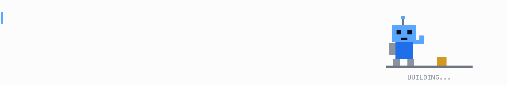

# Hey, I’m Graham.

I build things and fix broken ones.

<picture>
  <source media="(prefers-color-scheme: dark)" srcset="assets/intro-dark.gif">
  <source media="(prefers-color-scheme: light)" srcset="assets/intro-light.gif">
  
</picture>

[lambe.dev ↗](https://www.lambe.dev) · [Say hello](mailto:graham@lambe.dev)

### The toolbox

  
  
  
  
  
  
  
  
  
  
  

  
  
  
  
  
  
  
  
  

